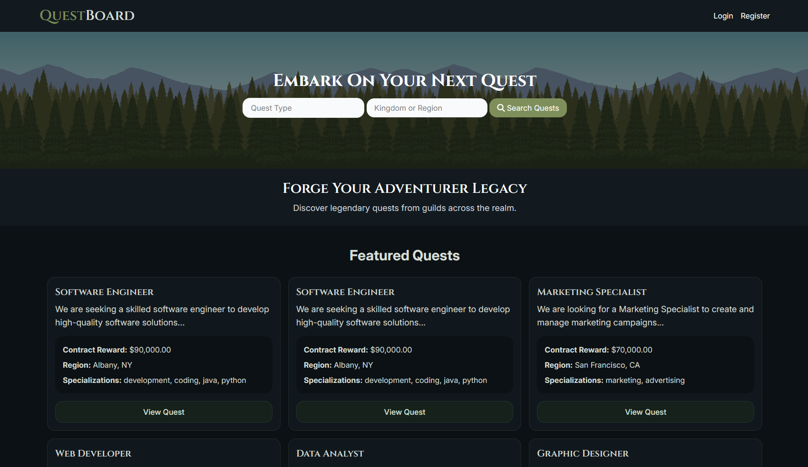

# QuestBoard (ws03)

A small custom PHP MVC-style web application for listing jobs and showcasing a case-study blog post migrated to the QuestBoard site.

## Features
- Lightweight MVC structure using PSR-4 autoloading (see `composer.json`).
- PDO-based database access (`Framework/Database.php`).
- Listings CRUD, user auth, and a static blog page used for a case study.

## Tech stack
- PHP (plain PHP, no framework) with PSR-4 autoloading
- PDO / MySQL (config in `config/db.php`)
- Simple custom `Framework/` utilities: `Router`, `Database`, `Session`, `Validation`.

## Accessing the site
- Home: `/` (see [public/index.php](public/index.php#L1) + [routes.php](routes.php#L1))
- Listings: `/listings` and related CRUD routes defined in `routes.php`.
- Auth (login/register): `/auth/*` routes handled by `UserController`.
- Blog (other case study page): `/blog` — currently served by [`App/controllers/BlogController.php`](App/controllers/BlogController.php#L1) and view in [`App/views/blog.view.php`](App/views/blog.view.php#L1).

## Image Gallery

*QuestBoard's home page (aka JobSeeker), showcasing the job listings and user authentication features.*


*The blog page, for the other case study.*

## Important files
- Entrypoint: [public/index.php](public/index.php#L1)
- Routes: [routes.php](routes.php#L1)
- DB config: [config/db.php](config/db.php#L1)
- Controllers: [App/controllers/](App/controllers/)
  - Home: [App/controllers/HomeController.php](App/controllers/HomeController.php#L1)
  - Listings: [App/controllers/ListingController.php](App/controllers/ListingController.php#L1)
  - Users: [App/controllers/UserController.php](App/controllers/UserController.php#L1)
  - Blog: [App/controllers/BlogController.php](App/controllers/BlogController.php#L1)
- Views: [App/views/](App/views/)
  - Blog view (current): [App/views/blog.view.php](App/views/blog.view.php#L1)

## Installation (local)
1. Clone the repo and install dependencies (if any). Composer autoload is present but no external packages are required by default.

```bash
git clone https://github.com/ROB0520/questboard.git questboard
cd questboard
composer install  
```

2. Configure your database connection in `config/db.php` to match your environment.

3. Create a MySQL database (example uses `jobseeker`):

```sql
CREATE DATABASE jobseeker CHARACTER SET utf8mb4 COLLATE utf8mb4_unicode_ci;
```

4. (Optional) Create minimal tables used by the app. Example DDL snippets below.

5. Run the app using a local webserver. With PHP built-in server (development only):

```bash
php -S localhost:8000 -t public
# Then open http://localhost:8000/
```

If you're using Laragon or another local stack, point the virtual host's document root at the `public/` folder.

## Disclaimer

This project is for **educational purposes and is not production-ready**.

## Minimal DB schema snippets
Use these as starting points; adjust types and constraints to suit your DB.

```sql
-- users
CREATE TABLE users (
  id INT AUTO_INCREMENT PRIMARY KEY,
  name VARCHAR(191) NOT NULL,
  email VARCHAR(191) NOT NULL UNIQUE,
  city VARCHAR(100),
  state VARCHAR(100),
  password VARCHAR(255) NOT NULL,
  created_at TIMESTAMP DEFAULT CURRENT_TIMESTAMP
);

-- listings
CREATE TABLE listings (
  id INT AUTO_INCREMENT PRIMARY KEY,
  user_id INT NOT NULL,
  title VARCHAR(255) NOT NULL,
  description TEXT,
  company VARCHAR(191),
  city VARCHAR(100),
  state VARCHAR(100),
  salary VARCHAR(100),
  tags VARCHAR(255),
  created_at TIMESTAMP DEFAULT CURRENT_TIMESTAMP,
  FOREIGN KEY (user_id) REFERENCES users(id) ON DELETE CASCADE
);
```

## Development notes
- Helpers: `helpers.php` includes `view()` and `redirect()` utilities used by controllers and views.
- Autoloading: PSR-4 configured in `composer.json` (`App\` -> `App/`, `Framework\` -> `Framework/`).